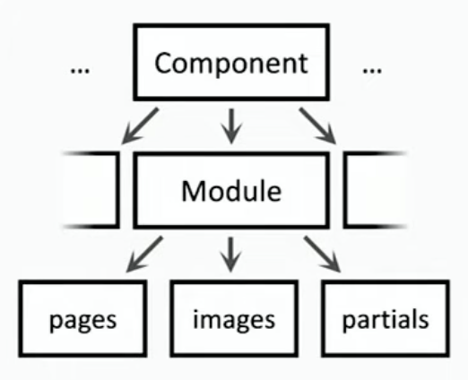
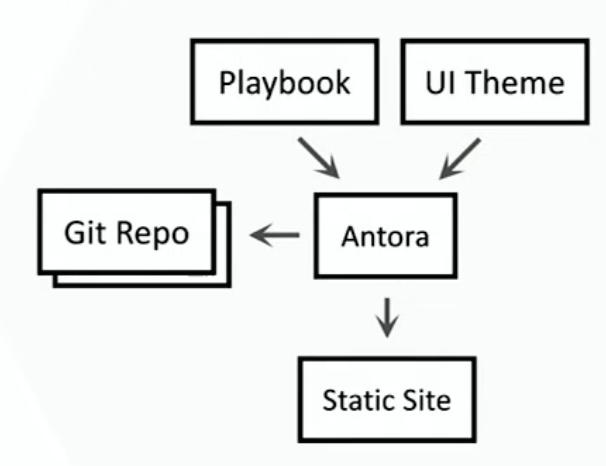
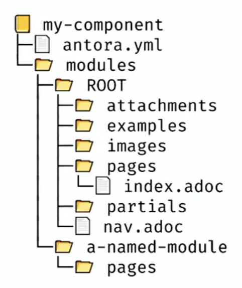

== Text formatting

Each sentence should be in a separate line.

Every blank lines create a new paragraph.

We can write *BOLD* text by surrounding it with asterisks.
Also, we can write _ITALIC_ text by surrounding it with underscores.

lists

. work
. with
. dots

to make them numbered and 

* asterisks
* to
* make
* them

bulleted.

[IMPORTANT]
--
We can mark a paragraph as important by using the IMPORTANT block.
--

TIP: There is also the shorter one-linesyntax.

===
This is an example block. Use it to highlight examples to your readers.
===

----
This is a listing.
You can provide syntax highlighting for the code by specifying the language after the opening delimiter.
----

.Standard include
[source,bash]
----
include::../../../devenv/scripts/bun.sh[]
----

:icons: font

.Pick a block with callout 
[source,java,indent=0]
----
include::../../../production/nukrates/xtension/core/src/main/java/com/xtension/core/CoreApplication.java[tag=sop]
----
<1> this is your first line of Java code.

== Tables 
Tables are blocks, `|===` marks their beginning and end, and `|` marks the beginning of a cell.

.Table title
[cols="1,1,3a,1", options="header"]
|===

|H1|H2|H3|H4

|Cell 1

|Cell 2

|Formatting *of words* works like in _before_ if you switch the column or cell to AsciiDoc format.

|Cell 4

|Cell 5

|Cell 6

|`options="header"` makes the first row a header row. _So the first row is repeated on every page if the table spans multiple pages._

|Cell 8

|A|B|C|D
|1|2|3|4
|E|F|G|H

|===

== Pictures

*Images can be included in the document using the image block. The image is copied to the output directory when the document is built.*

An  image in-line.

An image with a caption:

.This is a caption for the image.

_For schematic drawings, it is recommended to use vector graphics (SVG) instead of raster graphics (PNG, JPG). Web and PDF results are scalable and maintain quality at any size._

== Diagrams

To store diagrams as text, we can use the [plantuml] block. The diagram is generated when the document is built.

.Diagrams can have a caption as well.
plantuml::showcase_swimlane.puml[format=svg, alt="Swimlane diagram", caption="Swimlane diagram"]

=== What is Swimlane diagram?

== Antora structure

. *Multiple independent components*. They can be combined into a single documentation site using Antora. Each component has its own repository and is versioned independently. The documentation for each component is stored in the `docs` directory of the component's repository.

. *Each component is identified by name and version.* It has a `antora.yml` file in its root directory. This file contains metadata about the component, such as its name, version, and title. It also specifies the location of the documentation files for the component.

3. *One navigation per component*. Each component has its own navigation structure, which is defined in the `nav.adoc` file in the `docs` directory. The navigation structure can be customized for each component, and it can include links to other components.

4. *Each component can have multiple modules.* Each version of a component has its own set of documentation files, which are stored in a separate directory under the `docs` directory. The versioning system allows users to access the documentation for different versions of a component.

. *Each module has pre-defined families for pages, images, examples, attachments, static files, and partials (content snnipets to be included in multiple locations).* Each module has a `pages` directory that contains the documentation pages for the module. It also has an `images` directory for images, an `examples` directory for code examples, an `attachments` directory for attachments, a `static` directory for static files, and a `partials` directory for partials.

TIP: (advanced features); a component can be distributed across multiple folders, branches and repositories. The `antora.yml` file can specify the location of the documentation files for the component, and it can include multiple `content` entries that point to different directories or repositories.

[IMPORTANT]
Start simple then add complexity. The Antora documentation site can be built using the `antora` command-line tool, which takes a playbook file as input. The playbook file specifies the components to include in the site, as well as the output format and other options.

== Antora process

*What user does:*
. Run `antora`

*What `Antora` does:*

. Load `Antora` playbook file with list of branches and repositories.

. Clone Git repository.

. Create `HTML` output from `AsciiDoc`.

. Merge with `UI` theme and `UI` customizations.

. Optional: create search index.

. Create output folder with static site.

. It can be uploaded to a web server or hosted on GitHub Pages.

=== Mine notes
* Reads the playbook file

* Reads the `antora.yml` file for each component

* Reads the `nav.adoc` file for each component

* Reads the documentation files for each component

== Antora roles

Responsibilities of each role in the Antora process are as follows:

.Role responsibilities
[cols="1,2a,2", options="header"]
|===

|Role|Professional Skills|Responsibilities

|Author|Structuring and writing|
. `Git` to colloborate with other authors
. `AsciiDoc` (to create content)
|Documentation Ops|Automation and infrastructure|
. `Git` (for initial setup and maintenance)
. `YAML` for configuration
. `package.json` for dependencies
. CI/CD for automation
|Web developer|Web site creation|

. `HTML` and `CSS` for styling and `Antora` theme customization

. `JavaScript` for interactivity

|===

== Antora author

*First steps*

. Create first component folder structure.

. Create `antora.yml` and gives the component a name and version.

. Create `index.adoc` in pages.

. Create navigation entries in `nav.adoc` and add it to `antora.yml`.

*Document Ops*

. Install `antora` (either via package manager, e.g., npm, or `package.json` file).

. Create playbook to generate local preview site for authors.

. Create playbook to generate production site for users on the Internet.

*Web developer*

. Copy the existing UI theme (or create your own).

. Add UI customizations to the theme (e.g., colors, fonts, layout).